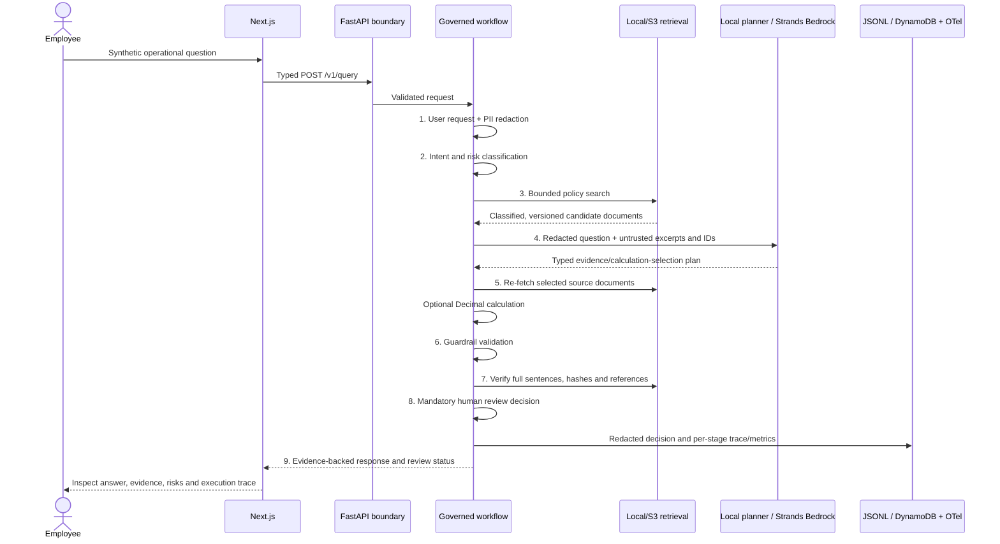
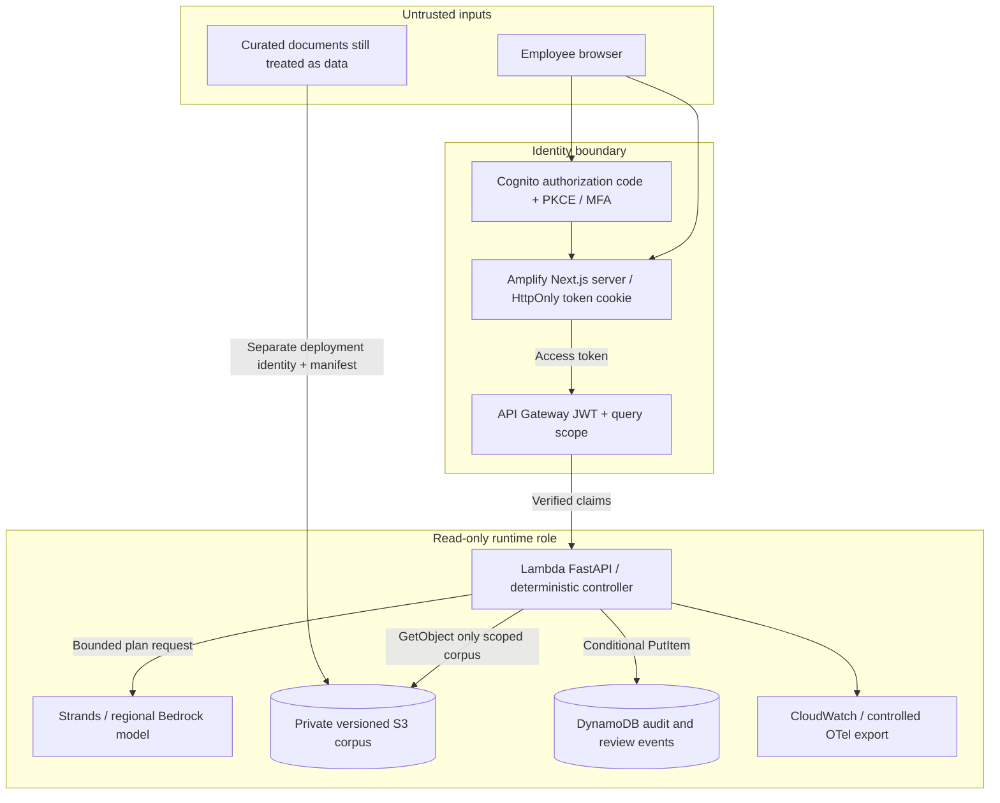

# Architecture

## Architecture Decisions

| Decision | Reason and tradeoff |
| --- | --- |
| Bounded agent beyond retrieval | Questions can require policy lookup, a typed calculation, quantitative evidence and mandatory escalation. The controller executes these steps; Strands only proposes an evidence-selection plan. More autonomy has no demonstrated benefit here. |
| Deterministic financial tools | Decimal arithmetic exposes formulas, inputs, rounding and provenance. A language model neither computes financial features nor interprets a number as credit authority. |
| No model credit decision | A grounded quotation or a plausible ratio is insufficient authority to lend. No approval, transaction or customer-write capability exists. |
| Local deterministic baseline | Offline tests are repeatable and inexpensive; a simpler baseline makes the incremental benefit and failure rate of a live model measurable. Its scores are not an LLM benchmark. |
| Amazon Bedrock | The intended AWS deployment can use IAM-based managed model access without a model API key in application code. Model availability, regional suitability and quality require actual sandbox validation. |
| Databricks financial computation | The data platform owns source provenance, normalization, data quality and reproducible Bronze/Silver/Gold computation. The application consumes a bounded Gold profile through a read-only adapter. This separation permits independent formula review and data access control. |
| Human review as a hard boundary | Code can require review and the model can add review, but neither can waive a requirement. An event records routing; it does not represent completed human approval. |

For a real Japanese financial institution, the proposed next steps are an
institution-owned Japanese policy corpus, bilingual expert evaluation, Japanese
PII/DLP handling, purpose and entitlement controls, a staffed review process,
vendor and outsourcing assessment, and explicit data-location/transfer decisions.
Selecting a Tokyo region alone would not establish compliance. Legal, privacy,
security and model-risk owners must decide applicability and approve controls.

These are architecture recommendations, not a legal determination. The FSA's
[AI Discussion Paper page](https://www.fsa.go.jp/en/news/2025/20250304/aidp.html)
records version 1.1 published March 3, 2026; it is a discussion reference rather
than a project certification. The PPC/FSA
[financial-sector personal information guidelines](https://www.ppc.go.jp/personalinfo/legal/kinyubunya_GL/)
address purpose, sensitive information, security measures and supervision, and
refer to the broader guidelines for overseas provision. Recheck these primary
sources with counsel before any institutional deployment (reviewed 2026-09-09).

## Scope and decisions

The business unit is an imaginary bank operations team. No real institution is
represented. The architectural goal is traceable procedural guidance with a
hard boundary between recommendation support and authorized business execution.
All important policy recommendations are rendered as complete source sentences.

The local planner is deterministic. The Bedrock planner uses Strands Agent with
structured output and no business tools. It selects evidence IDs from the
controller's candidates and may request a calculation or review. Its plan never
contains a shell command, tool name, arbitrary tool arguments, or free-form answer.

## Request lifecycle

The trace records all nine stages even for safe refusals. Tools invoked within a
stage have child spans; one parent span correlates the request. Model-call failure,
retrieval errors, stale evidence, tool failure, and audit persistence errors fail
closed. A failed model estimate is explicitly incomplete; zero is not presented as
a verified cost for an unknown billed request.

Stage `status=ok` means the controller completed the stage, including a handled
failure that resulted in abstention. Recovered model/retrieval failures appear in
response risk flags and parent-span attributes; tool invocation errors have
`status=error`. If audit persistence itself fails, the API returns an unavailable
response and a complete nine-stage record cannot be promised.

## Deployment and trust boundaries

The browser cannot select its classification, role, corpus, planner, or tools.
Cloud authorization depends on gateway-verified claims in the Lambda ASGI scope,
not a caller-supplied role/header. Local mode binds published ports to loopback;
it is a development trust boundary and must not be publicly exposed.

## Retrieval

`Retriever.search` and `Retriever.get` are replaceable interfaces. Local retrieval
uses BM25-like lexical scoring with domain synonyms and deterministic tie-breaking.
Classification filtering happens before scoring; future and superseded versions
are unavailable. Search is bounded to at most ten hits.

S3 loads a curated manifest and verifies each JSON object's SHA-256. Keys must
stay in `corpus/`; the adapter rejects duplicates, oversized objects, bad schema,
and integrity mismatches. It caches a maximum 256-document corpus for 60 seconds
and uses the same local index. This is a deployable small-corpus implementation,
not a vector database. Replace it with a governed Bedrock Knowledge Base or
OpenSearch adapter when scale, semantic recall, or entitlement filtering requires
it. A manifest hash is integrity checking, not publisher authentication when an
attacker can change both object and manifest.

## Calculations and citations

Only debt-to-income, simple interest (actual/365), and sums are available. Inputs
are typed decimal operands with cardinality, magnitude, precision, and financial
domain checks. API quantities must be decimal strings or integers; floats and
booleans are rejected. DTI inputs must cover the same period; the controller does
not verify their business accuracy. Results include units, formula, operands, and ROUND_HALF_UP output.
There is no Python eval, expression parser, arbitrary shell, or runtime plugin
discovery. Developer scripts and CDK deployment tools are outside the agent role.

The verifier re-fetches permitted documents, rejects unsafe sources, requires a
complete exact source sentence or full document, and matches the text hash.
Re-fetching checks the retriever's current snapshot. A changed snapshot causes
abstention; no attempt is made to silently reconcile it. The S3 adapter's 60-second
warm cache can defer detection of an S3 update or revocation; these calls do not
guarantee fresh S3 reads within a request. Calculation facts are
grounded in deterministic provenance; policy facts are grounded in excerpts.

Selecting an excerpt retains the complete candidate source paragraph, including
its caveats. Each detected operational topic must have selected synthetic policy
support; public-only selections cannot authorize an operational recommendation.

## Review and persistence

Risk, missing information, conflicts, model failure, and prohibited requests can
require review. The model may add a review requirement but cannot remove a code
requirement. Local review decisions are JSONL audit events; AWS stores conditional
PutItem events in DynamoDB. There is no human approval UI or downstream execution
API. A real review system would need reviewer identity, reason, case status,
segregation of duties, retention and override governance before any action.

## Operations

In Lambda, a dedicated INFO handler mirrors allowlisted audit JSON to the captured
log stream, and the configured console exporter emits controlled OTel spans to
CloudWatch. `AUDIT_CONSOLE=1` enables the same audit mirror outside Lambda.
The runtime never exports Strands-owned prompt/content spans. Model latency,
retrieval latency, tokens, estimated cost, stage/tool timing, and routing outcome
appear in the response and controlled telemetry. Mangum lifecycle shutdown attempts
a bounded one-second span flush before Lambda freezes. Export is still best effort;
audit persistence is separate and fails closed. CI validates contracts and the
synthesized security properties; live cloud behavior still requires deployment
testing, load/failure exercises, and an operational owner.
