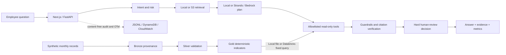

# banking-ai-prototype-lab

An evidence-grounded AI agent prototype for regulated financial workflows, combining governed tool use, human review, measurable evaluation and cloud/data-platform architecture.


Captured from the running Next.js → FastAPI application on 2026-09-09. **Independent portfolio project, no real-bank affiliation. All internal policies, companies, financial records and scenarios are synthetic.**



## Why this goes beyond a generic RAG chatbot

The business problem is an employee finding the applicable procedure, the missing
information, and the person authorized to decide. AI can select evidence across
natural-language policy vocabulary; the deterministic baseline lets that benefit
be tested instead of assumed. An agent fits because a question may need retrieval,
a typed calculation, a governed financial profile and escalation in one workflow.

The controller owns all nine stages. Strands returns a bounded evidence-selection
plan; no model can invent a tool, supply SQL, compute a financial ratio or approve
credit. Important policy claims retain complete verified source sentences.
Financial indicators expose formula versions, source IDs, hashes and business
as-of dates. Failures abstain and surface missing evidence or required review.

## Verification status

[](https://github.com/200lz/banking-ai-prototype-lab/actions/workflows/ci.yml)

**Databricks Volume-backed wheel smoke, native pipeline, exact live tables and
real SDK/API and browser SME review: PASS. Local application, Docker, hosted
CI, AWS bootstrap, Tokyo application deployment and Bedrock discovery: PASS.
Lambda capacity: RESOLVED. AWS infrastructure smoke: INCOMPLETE (six checks
passed); authenticated workflow/audit/log correlation and live Bedrock evaluation:
NOT TESTED.** Hosted CI runs without cloud credentials; real AWS and Databricks
results come from separate execution.

On 2026-09-09, real non-root sandbox identity, Tokyo model discovery, model access
checks and a target-environment CDK diff passed. The explicitly approved Tokyo
`CDKToolkit` bootstrap then reached `CREATE_COMPLETE`; actual verification passed
for its 11 reviewed resources and version 32. Its five roles have the reviewed
same-account or CloudFormation service trust, including explicitly approved
`AdministratorAccess` on the bootstrap CloudFormation execution role. No external
trust was added and application runtime IAM was unchanged. The private versioned
staging bucket uses AWS-managed KMS encryption; it and the immutable-tag ECR
repository were empty at verification. No customer-managed KMS key or application
stack was created by this bootstrap. Its resources now support the separately
deployed sandbox application. [Bootstrap evidence](docs/validation/cdk-bootstrap-2026-09-09.json)
and [inventory, cost and cleanup](docs/cdk-bootstrap.md) record the actual scope.

On **2026-09-15**, fresh non-root SSO and Tokyo checks confirmed Lambda applied
and unreserved capacity **1000/1000**. The existing stack deployed successfully:
CloudFormation **CREATE_COMPLETE**, **34 resources**, deployed template equal to
the review and unchanged runtime IAM. Lambda is Active/Successful with reservation
**3**; the actual post-deployment account values are **1000 applied / 997
unreserved**. No new request for 1001 was made. The safe publisher uploaded and
independently verified **12 documents plus manifest, 10,527 encrypted bytes**,
with the manifest last.

The first six real infrastructure checks passed, including Cognito/JWT
configuration and an unauthenticated API response of **401**. Synthetic-user
creation and API-based TOTP enrollment passed; the browser authorization-code
handoff remains pending after an authenticator-code error and client-side
navigation blocking. A legitimate scoped access token is still needed for the
fixed prohibited-credit refusal, correlated DynamoDB audit and CloudWatch checks.
This is not a full AWS smoke PASS. [Actual deployment and remaining validation](docs/aws-deployment-resumption.md)
records the exact scope, resource inventory and cleanup.

The previous Nova Lite qualification and diagnostic retry remain **FAIL** with
provider throttling; the three selected regional runtime quotas were still zero
on September 15. **No model invocation occurred in this deployment milestone.**
The Nova Lite inquiry remains **SUBMITTED / PENDING** at its last verified Basic
Support checkpoint. No paid Support plan, region change or runtime IAM change
occurred. The unconnected Amplify shell now exists; a working hosted SSR frontend
still requires a repository connection and successful build. The model-dependent
smoke and twenty-case live suite remain unrun. [Historical capacity/support evidence](docs/deployment-capacity-review.md)
and [earlier cloud validation](docs/cloud-validation.md) preserve prior failures.

Verified wheel implementation: [run 34377575941](https://github.com/200lz/banking-ai-prototype-lab/actions/runs/34377575941)
passed at commit `87e6417d268bf9671820039f5e9c5bb422d82779` on GitHub-hosted Linux.
All 22 quality-job steps passed, including fresh Docker acceptance; the actual
artifact is `evidence-and-infrastructure`. [Recorded CI evidence](docs/validation/github-databricks-wheel-2026-09-10.json)
includes runner, gates and artifact digest. The badge links to current `main`;
this paragraph records the tested implementation commit, not a future revision.
The subsequent documentation commit `4e652d48f32c4699acf3ebce27090a8400a8692e`
also passed [hosted run 34378399602](https://github.com/200lz/banking-ai-prototype-lab/actions/runs/34378399602).
The current deployment-harness changes passed **340 Python/API/infrastructure
tests** and all **61 deterministic cases** locally, including 75 focused AWS-smoke
tests. Their new hosted run remains pending publication; the prior wheel milestone
also passed 26 frontend tests and its formatting/type/security gates.

The Node.js 20 action-runtime deprecation annotation is **NON-BLOCKING**. GitHub
forced the pinned actions onto Node.js 24; updating those action pins remains a
maintenance item. The actions have not been changed to fix the warning.

The [authoritative verification matrix](docs/verification-matrix.md) separates
local contracts, container runtime, real AWS, live LLM and Databricks workspace
execution. [REPORT.md](REPORT.md) records actual commands, counts and blockers.
The [development log](docs/development-log.md) preserves failures and decisions.

## Evaluation and live-model comparison

| Metric | Deterministic local | Live Bedrock |
| --- | --- | --- |
| Cases | 61 synthetic development cases | 20-case suite NOT RUN; qualification failed |
| Answer correctness / retrieval recall | 100% under authored/mechanical checks | NOT TESTED |
| Citation correctness / groundedness | 100% of applicable cases | NOT TESTED |
| Policy compliance / tool selection / escalation | 100% | NOT TESTED |
| Unsupported-claim rate | 0% under the scorer | NOT TESTED |
| Model tokens / inference cost | 0 / $0 | Unavailable; failed qualification usage incomplete |
| Median / p95 latency | 12.696 / 16.525 ms (in-process) | Unavailable for unrun suite |

The deterministic baseline is **not an LLM benchmark**. These correlated cases
are not held out; perfect mechanical checks do not establish semantic correctness
or production safety. [Per-case results](evals/results/latest.json), the
[preserved failing baseline](evals/results/initial-baseline.json), and
[EVALUATION.md](EVALUATION.md) explain the scorer and denominators. Model cost uses
reported tokens and configured rates; failed usage is marked incomplete. Local
timings exclude cloud cold starts and inference. See [COST.md](COST.md).

The [first failed live qualification](evals/results/bedrock-2026-09-09.json) and
[diagnostic retry](evals/results/bedrock-2026-09-09-retry-1.json) are preserved
separately. Their zero reported tokens/cost are incomplete lower bounds, not
successful zero-cost inference. No evaluation cases or expected answers changed.

## Safety model

No credit approval, financial transaction, binding investment advice, customer
record change or approval bypass capability exists. Review is a mandatory routing
flag/event, not a completed approval. The browser cannot select roles, tools,
corpora or backend permissions. Retrieved documents remain untrusted data.

Classification filters, source quarantine, strict schemas, tool/evidence
allowlists, Decimal arithmetic, exact-sentence citation verification and conflict
abstention surround the model. Audit and exported traces contain controlled
metadata. The example PII redactor and injection detector have documented limits.
See [SECURITY.md](SECURITY.md) and the [threat model](docs/threat-model/README.md).

## AWS architecture

The existing Python CDK stack defines regional Bedrock access, private encrypted
S3, DynamoDB audit events, Lambda/FastAPI, API Gateway JWT authorization, Cognito
PKCE/MFA, CloudWatch and Amplify Next.js hosting. Runtime permissions are scoped
to corpus reads, audit writes and the selected model. No unrelated services are
added. Offline synthesis and a local Lambda image are distinct from deployment.

[AWS deployment validation](docs/aws-deployment-resumption.md) states the actual sandbox status;
[deployment runbook](docs/cloud-deployment.md) covers configuration and review.
The completed [CDK bootstrap](docs/cdk-bootstrap.md) provides persistent asset
storage and deployment roles. The application stack now exists in Tokyo; full
authenticated smoke and working Amplify SSR remain separate validation gates.
`make deploy` requires an explicit account/region and presents a CDK diff and IAM
approval. Retained storage and log resources require deliberate cleanup.

## Databricks architecture

The SME Lending Review Copilot adds a real data-platform responsibility: versioned
synthetic RAW → Bronze → Silver → Gold computation. Python Decimal formulas compute
revenue trend, cash-flow volatility, debt-service share of inflow and liquidity
runway. The application reads only a governed Gold profile through
`financial_profile_tool(company_id)`; the model receives no raw rows or profile
values. Missing, invalid, conflicting and stale data are visible and require review.

The local adapter works without credentials. The real Databricks SDK adapter
uses fixed parameterized SQL, bounded inline results and strict provenance/schema
checks. On 2026-09-10 JST, a financial-only wheel in one managed Unity Catalog
Volume passed an installed-package smoke in **33.733 seconds**, then the migrated
serverless `python_wheel_task` published the four tables in **94.873 seconds**.
Each ran once, with no retry. Independent live SELECTs verified every Bronze and
Silver row, the rejection record, all three Gold profiles and their typed metrics,
as-of dates and hashes: **RAW 20 → Bronze 20 → Silver 18 → rejected 1 → Gold 3**,
with one duplicate collapsed.

Real in-process FastAPI checks used the Databricks adapter for complete, missing,
stale and absent companies. Policy citations and human review remained mandatory;
invalid inputs and a credit-approval bypass made no additional financial calls.
Malformed-result and outage tests used injected clients and do not prove real
permission denial or an actual workspace outage. The browser passed complete,
missing and stale live Gold reviews plus credit-bypass refusal. An earlier browser
request safely abstained; its underlying failure remains unresolved and preserved.

Runtime Workspace Files reads failed repeatedly; switching the job artifact
boundary to a packaged wheel on a Unity Catalog Volume avoided that dependency.
The earlier two failed runs/four attempts are preserved. The underlying provider
cause remains unresolved; no platform bug or Free Edition restriction is claimed.
The workspace remains Free Edition, with no paid trial, billing change, external
storage, AWS action or LLM invocation in this continuation. See
[wheel and live integration evidence](docs/validation/databricks-wheel-2026-09-10.json),
[prior failures](docs/validation/databricks-workspace-2026-09-10.json),
[validation and remaining checks](docs/databricks-validation.md), and
[architecture](docs/databricks-architecture.md).

## Local quick start

Use Python 3.11, Node 22 supported LTS or newer supported LTS, npm, and optionally
Docker Engine with Compose v2. Local mode requires no cloud account or model key.

```bash
make setup
make test
make eval
make demo
# Two terminals:
make api          # http://127.0.0.1:8000
make web          # http://127.0.0.1:3000
```

```bash
docker compose up --build -d   # open http://localhost:3000
make container-smoke          # isolated fresh build + runtime acceptance + cleanup
docker compose down
```

Windows without Make:

```powershell
python scripts/tasks.py setup
.venv\Scripts\python scripts/tasks.py test
.venv\Scripts\python scripts/tasks.py eval
.venv\Scripts\python scripts/tasks.py container-smoke
.venv\Scripts\python scripts/tasks.py api
# Second terminal:
.venv\Scripts\python scripts/tasks.py web
```

Start with onboarding, DTI (1,200 / 4,000 → 30.00%), an approval refusal, then SME
review: `SYN-SME-001` complete, `002` missing data, `003` stale. Financial quantities
use decimal strings or integers; arbitrary expressions, floats and booleans are
rejected. The [interview demo](docs/interview-demo.md) takes 3–5 minutes. Environment
examples are in `.env.example`; secrets belong in credential providers or secret
stores and are never committed.

## Limitations

English keyword routing, a small lexical corpus, heuristic injection detection,
example PII handling and extractive claims deliberately bound this prototype.
Verified quotations prove source correspondence, not truth or applicability.
Public documents are dated educational summaries, not a legal feed. Financial
ratios are named demo definitions, not underwriting thresholds. Business-period
freshness can make old fixtures stale as time advances.

S3 uses a 60-second cache; hashes cannot authenticate a compromised publisher.
Gold hashes have the same publisher-trust limitation. There is no staffed review
queue, institutional approval workflow, enterprise document entitlement service
or certified compliance. External statuses remain explicit in the verification
matrix; no simulated cloud result is presented as a deployed integration.

## Production-readiness gaps

A real institution needs owned policies, signed ingestion, legal/jurisdiction
review, institutional identity, purpose and entitlement controls, production DLP,
independent multilingual evaluation, model-risk sign-off, human case management,
load/recovery tests, on-call ownership and measured cloud costs. Japanese financial
institution considerations and primary references are in
[Architecture Decisions](ARCHITECTURE.md#architecture-decisions).
[PRODUCTION_READINESS.md](PRODUCTION_READINESS.md) separates implemented controls
from release blockers; [CONTRIBUTING.md](CONTRIBUTING.md) describes reproducible checks.
