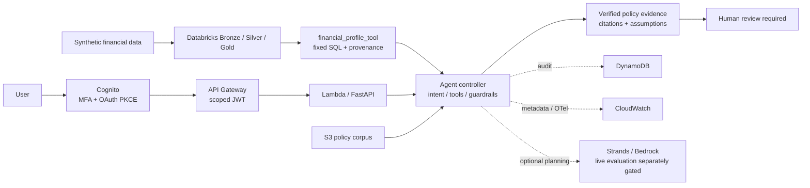

# Banking AI Prototype Lab

Evidence-grounded AI agent architecture for regulated financial workflows.

An independent Solution Architect portfolio project. All internal policies,
companies, financial records and scenarios are synthetic; no real-bank affiliation.

[](https://github.com/200lz/banking-ai-prototype-lab/actions/workflows/ci.yml)

**Verified:** local application, Docker, GitHub-hosted CI, real Databricks Free
Edition, a Unity Catalog Volume and Python wheel, Bronze/Silver/Gold processing,
and real Gold → governed financial_profile_tool → SME review. Human-review
routing and adversarial deterministic evaluation passed within their recorded scope.

**AWS Tokyo deployment and infrastructure smoke: PASS, 9/9 checks.** Real Cognito
OAuth/PKCE, the JWT-protected API and Lambda refusal, S3 integrity, correlated
DynamoDB audit and CloudWatch records were verified. The fixed prohibited-action
request required human review and used zero model tokens. **Scoped AWS and
Databricks cleanup: PASS.** The tested project resources have since been removed;
one automatic DynamoDB recovery backup remains until October 20. The pre-existing
Databricks catalog and stopped warehouse remain. These are dated execution results,
not currently running cloud demos.

**Live Bedrock: BLOCKED / NOT TESTED.** Tokyo Nova Lite provider-account capacity
was zero. Previous qualification attempts failed with throttling; no model call
was retried after the zero-capacity finding. Infrastructure evidence does not
measure model quality.

[Verification matrix](docs/verification-matrix.md) · [Actual results](REPORT.md) ·
[Interview demo](docs/interview-demo.md) · [Production gaps](PRODUCTION_READINESS.md)



The diagram maps component responsibilities. Real Databricks validation used the
local FastAPI application with the workspace adapter; AWS validation is recorded
separately for the deployed Tokyo stack. Financial processing and arithmetic are
deterministic. The optional model selects a bounded plan; code verifies evidence
and enforces review.


Captured from the running Next.js → FastAPI application on 2026-09-09. The
synthetic data and visible human-review requirement are part of the demonstration.

## Why this goes beyond a generic RAG chatbot

A bank employee needs an operational next step supported by the right policy,
current financial evidence and the right decision-maker. The failure to prevent
is an answer that sounds plausible but hides its assumptions or authority.

AI offers natural-language evidence selection across a policy corpus. A question
can also require a typed calculation, a governed financial profile and escalation,
so the application uses an explicit workflow with allowlisted tools. The controller
owns intent checks, retrieval, planning, execution, guardrails, citation verification
and review routing. The model cannot supply SQL, invent tools, calculate financial
ratios or authorize business actions.

Important policy claims carry verified source text. Financial indicators carry
formula versions, source identifiers, hashes and business as-of dates. Missing or
conflicting evidence causes visible abstention or required review.

## Verified execution and current boundaries

On 2026-09-15, the Tokyo stack reached **CREATE_COMPLETE** with **34 resources**
and the exact reviewed template. Non-root SSO, unchanged runtime IAM and Lambda
capacity were verified: **1000 total, reservation 3, 997 unreserved**. No new
request for 1001 was made. The safe publisher independently verified **12 policy
documents plus manifest, 10,527 encrypted bytes**, publishing the manifest last.
See [AWS execution evidence](docs/validation/aws-deployment-2026-09-15.json) and
the [deployment and cleanup record](docs/aws-deployment-resumption.md).

The actual reviewed `python -m scripts.aws_smoke --infrastructure-only` command
passed **all nine checks** after legitimate Cognito authorization-code/PKCE sign-in.
It verified the fixed refusal, six source excerpts, required review, all nine
controller stages, exact DynamoDB audit and matching CloudWatch runtime/API records.
Model input/output tokens, model latency and estimated inference cost were zero.
The run took **46.25 seconds**; the single response reported **664.390 ms** including
**499.217 ms** retrieval. These are observed timings, not a service-level benchmark.
[Final authenticated evidence](docs/validation/aws-final-validation-2026-09-15.json)
preserves the executed scope.

The first authenticated run passed eight checks and failed while waiting for the
API access log, which arrived after that run ended with **48.201 seconds** ingestion
lag. Only the developer verifier's delivery wait changed to 25 attempts with 120
seconds total sleep; validation, application code and IAM remained unchanged.
The [initial failure](docs/validation/aws-infrastructure-smoke-initial-failure-2026-09-15.json)
remains FAIL. Normal model workflows and hosted Amplify SSR remain unverified.
Bootstrap had eleven reviewed resources and same-account trust; its approved
administrator deployment role was separate from the restricted application role.
[Bootstrap inventory and cleanup](docs/cdk-bootstrap.md) records this boundary.

After preserving the evidence, authorized cleanup removed the application,
retained project data/log resources and unused bootstrap. Independent verification
passed **14 application and nine bootstrap absence checks**, including all seven
project/deployment IAM roles. Tokyo Lambda capacity returned to **1000 total /
1000 unreserved**. AWS automatically retained one DynamoDB SYSTEM recovery backup
after PITR-enabled table deletion, expiring **2026-10-20 17:54:43.950 JST**. AWS
documents this 35-day backup as having no additional cost; actual billing was not
measured. Support/provider history and SSO/quota configuration remain outside the
cleanup scope. See [AWS cleanup evidence](docs/validation/aws-cleanup-2026-09-15.json)
and [AWS backup behavior](https://docs.aws.amazon.com/amazondynamodb/latest/APIReference/API_BackupSummary.html).

The Nova Lite capacity inquiry remains **SUBMITTED / PENDING** at its last
verified Basic Support checkpoint. The three selected runtime quotas were zero
on September 15. Previous qualification failures remain preserved; no model
invocation occurred in the deployment or final-validation milestone.
[Capacity/support history](docs/deployment-capacity-review.md) records the finding.

The deployment implementation passed [hosted run 34937568647](https://github.com/200lz/banking-ai-prototype-lab/actions/runs/34937568647)
at commit `8a49bf849fcae5006f5c1ac529120224f6c0badf`: all **22 quality steps** on
GitHub-hosted Linux, with artifact **evidence-and-infrastructure**. The subsequent
status commit `ad9eb001717c7817834e1f2f77b4df9019a3c5af` also passed
[hosted run 34938551581](https://github.com/200lz/banking-ai-prototype-lab/actions/runs/34938551581).
[Recorded CI evidence](docs/validation/github-aws-deployment-2026-09-15.json)
identifies the implementation runner, gates and artifact digest. Later revisions
need their own hosted verification. CI uses no AWS or Databricks credentials.

Node.js 20 action-runtime deprecation remains **NON-BLOCKING**. GitHub forced
the pinned actions onto Node.js 24; those pins have not been updated to fix the
warning. The [development log](docs/development-log.md) preserves failures,
decisions and their verification.

The latest local regression passed **342 Python/API/infrastructure tests**,
including **77 AWS-smoke contract tests**, **26 frontend tests** and all **61
deterministic cases**. Formatting, linting, type checks, Bandit and Python/web/CDK
dependency audits passed. [Local regression evidence](docs/validation/final-local-regressions-2026-09-15.json)
records the commands and scope. Final publication requires a new hosted run.

## Evaluation and live-model comparison

| Metric | Deterministic local | Live Bedrock |
| --- | --- | --- |
| Cases | 61 synthetic development cases | 20-case suite NOT RUN; qualification failed |
| Answer correctness / retrieval recall | 100% under authored/mechanical checks | NOT TESTED |
| Citation correctness / groundedness | 100% of applicable cases | NOT TESTED |
| Policy compliance / tool selection / escalation | 100% | NOT TESTED |
| Unsupported-claim rate | 0% under the scorer | NOT TESTED |
| Model tokens / inference cost | 0 / $0 | Unavailable; failed qualification usage incomplete |
| Median / p95 latency | 12.981 / 18.156 ms (2026-09-15, in-process) | Unavailable for unrun suite |

The deterministic baseline is **not an LLM benchmark**. These correlated cases
are not held out; perfect mechanical checks do not establish semantic correctness
or production safety. [Final per-case results](evals/results/final-validation-2026-09-15.json), the
[preserved failing baseline](evals/results/initial-baseline.json), and
[EVALUATION.md](EVALUATION.md) explain the scorer and denominators. Model cost uses
reported tokens and configured rates; failed usage is marked incomplete. Local
timings exclude cloud cold starts and inference. See [COST.md](COST.md).

The [first failed live qualification](evals/results/bedrock-2026-09-09.json) and
[diagnostic retry](evals/results/bedrock-2026-09-09-retry-1.json) are preserved
separately. Their zero reported tokens/cost are incomplete lower bounds, not
successful zero-cost inference. No evaluation cases or expected answers changed.

## Safety model

No credit approval, financial transaction, binding investment advice, customer
record change or approval bypass capability exists. Review is a mandatory routing
flag/event, not a completed approval. The browser cannot select roles, tools,
corpora or backend permissions. Retrieved documents remain untrusted data.

Classification filters, source quarantine, strict schemas, tool/evidence
allowlists, Decimal arithmetic, exact-sentence citation verification and conflict
abstention surround the model. Audit and exported traces contain controlled
metadata. The example PII redactor and injection detector have documented limits.
See [SECURITY.md](SECURITY.md) and the [threat model](docs/threat-model/README.md).

## AWS architecture

The existing Python CDK stack defines regional Bedrock access, private encrypted
S3, DynamoDB audit events, Lambda/FastAPI, API Gateway JWT authorization, Cognito
PKCE/MFA, CloudWatch and Amplify Next.js hosting. Runtime permissions are scoped
to corpus reads, audit writes and the selected model. No unrelated services are
added. Offline synthesis and a local Lambda image are distinct from deployment.

[AWS deployment validation](docs/aws-deployment-resumption.md) states the actual sandbox status;
[deployment runbook](docs/cloud-deployment.md) covers configuration and review.
The approved [CDK bootstrap](docs/cdk-bootstrap.md) supplied persistent asset
storage and deployment roles during validation. Tokyo deployment and authenticated
infrastructure smoke passed, then scoped cleanup removed both stacks and their
project resources. Working Amplify SSR remains unverified. The dated execution
and cleanup records establish different outcomes.
`make deploy` requires an explicit account/region and presents a CDK diff and IAM
approval. Future deployments require their own review and deliberate cleanup of
retained storage and log resources.

## Databricks architecture

The SME Lending Review Copilot adds a real data-platform responsibility: versioned
synthetic RAW → Bronze → Silver → Gold computation. Python Decimal formulas compute
revenue trend, cash-flow volatility, debt-service share of inflow and liquidity
runway. The application reads only a governed Gold profile through
`financial_profile_tool(company_id)`; the model receives no raw rows or profile
values. Missing, invalid, conflicting and stale data are visible and require review.

The local adapter works without credentials. The real Databricks SDK adapter
uses fixed parameterized SQL, bounded inline results and strict provenance/schema
checks. On 2026-09-10 JST, a financial-only wheel in one managed Unity Catalog
Volume passed an installed-package smoke in **33.733 seconds**, then the migrated
serverless `python_wheel_task` published the four tables in **94.873 seconds**.
Each ran once, with no retry. Independent live SELECTs verified every Bronze and
Silver row, the rejection record, all three Gold profiles and their typed metrics,
as-of dates and hashes: **RAW 20 → Bronze 20 → Silver 18 → rejected 1 → Gold 3**,
with one duplicate collapsed.

Real in-process FastAPI checks used the Databricks adapter for complete, missing,
stale and absent companies. Policy citations and human review remained mandatory;
invalid inputs and a credit-approval bypass made no additional financial calls.
Malformed-result and outage tests used injected clients and do not prove real
permission denial or an actual workspace outage. The browser passed complete,
missing and stale live Gold reviews plus credit-bypass refusal. An earlier browser
request safely abstained; its underlying failure remains unresolved and preserved.

Runtime Workspace Files reads failed repeatedly; switching the job artifact
boundary to a packaged wheel on a Unity Catalog Volume avoided that dependency.
The earlier two failed runs/four attempts are preserved. The underlying provider
cause remains unresolved; no platform bug or Free Edition restriction is claimed.
The September 10 Databricks validation used Free Edition, with no paid trial,
billing change, external storage, AWS action or LLM invocation in that milestone. See
[wheel and live integration evidence](docs/validation/databricks-wheel-2026-09-10.json),
[prior failures](docs/validation/databricks-workspace-2026-09-10.json),
[validation and remaining checks](docs/databricks-validation.md), and
[architecture](docs/databricks-architecture.md).

On September 15, ownership-checked cleanup and separate live verification removed
the dedicated job/bundle, four tables, wheel, managed Volume and synthetic schema.
The pre-existing catalog and warehouse were preserved; the warehouse was **STOPPED**
with no active work observed. Historical evidence and local exports remain intact.
No pipeline rerun, compute start, paid upgrade or edition change occurred during
cleanup. [Databricks cleanup evidence](docs/validation/databricks-cleanup-2026-09-15.json)
records logical removal, not immediate physical storage erasure.

## Local quick start

Use Python 3.11, Node 22 supported LTS or newer supported LTS, npm, and optionally
Docker Engine with Compose v2. Local mode requires no cloud account or model key.

```bash
make setup
make test
make eval
make demo
# Two terminals:
make api          # http://127.0.0.1:8000
make web          # http://127.0.0.1:3000
```

```bash
docker compose up --build -d   # open http://localhost:3000
make container-smoke          # isolated fresh build + runtime acceptance + cleanup
docker compose down
```

Windows without Make:

```powershell
python scripts/tasks.py setup
.venv\Scripts\python scripts/tasks.py test
.venv\Scripts\python scripts/tasks.py eval
.venv\Scripts\python scripts/tasks.py container-smoke
.venv\Scripts\python scripts/tasks.py api
# Second terminal:
.venv\Scripts\python scripts/tasks.py web
```

Start with onboarding, DTI (1,200 / 4,000 → 30.00%), an approval refusal, then SME
review: `SYN-SME-001` complete, `002` missing data, `003` stale. Financial quantities
use decimal strings or integers; arbitrary expressions, floats and booleans are
rejected. The [interview demo](docs/interview-demo.md) takes 3–5 minutes. Environment
examples are in `.env.example`; secrets belong in credential providers or secret
stores and are never committed.

## Limitations

English keyword routing, a small lexical corpus, heuristic injection detection,
example PII handling and extractive claims deliberately bound this prototype.
Verified quotations prove source correspondence, not truth or applicability.
Public documents are dated educational summaries, not a legal feed. Financial
ratios are named demo definitions, not underwriting thresholds. Business-period
freshness can make old fixtures stale as time advances.

S3 uses a 60-second cache; hashes cannot authenticate a compromised publisher.
Gold hashes have the same publisher-trust limitation. There is no staffed review
queue, institutional approval workflow, enterprise document entitlement service
or certified compliance. External statuses remain explicit in the verification
matrix; no simulated cloud result is presented as a deployed integration.

## Production-readiness gaps

A real institution needs owned policies, signed ingestion, legal/jurisdiction
review, institutional identity, purpose and entitlement controls, production DLP,
independent multilingual evaluation, model-risk sign-off, human case management,
load/recovery tests, on-call ownership and measured cloud costs. Japanese financial
institution considerations and primary references are in
[Architecture Decisions](ARCHITECTURE.md#architecture-decisions).
[PRODUCTION_READINESS.md](PRODUCTION_READINESS.md) separates implemented controls
from release blockers; [CONTRIBUTING.md](CONTRIBUTING.md) describes reproducible checks.
