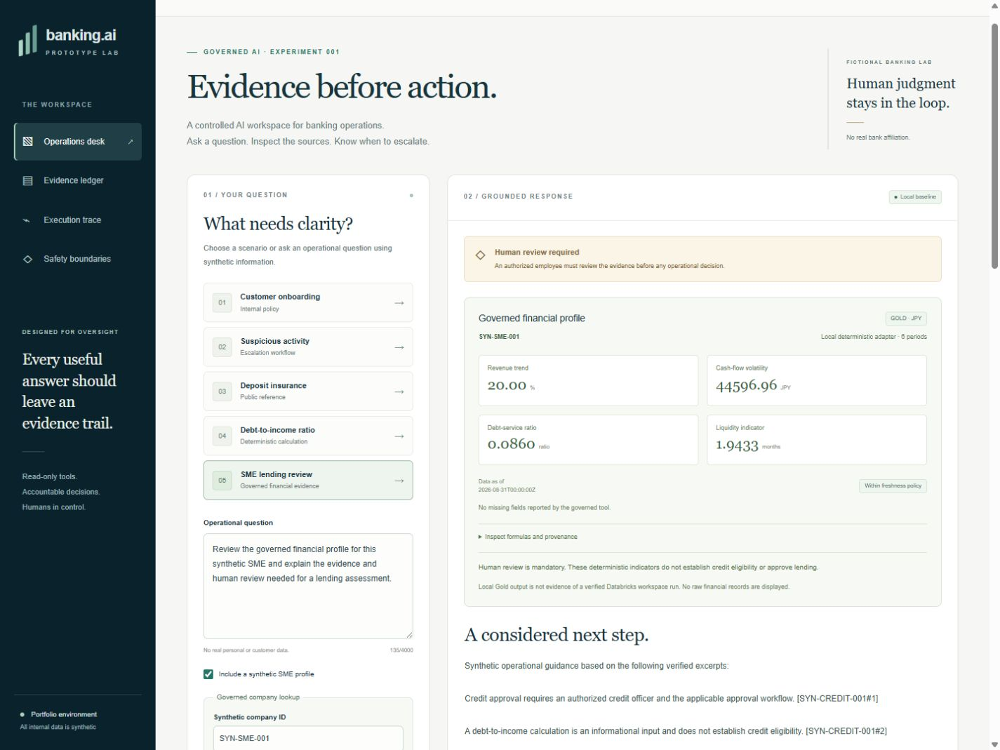
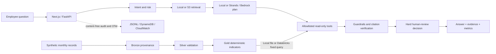

# banking-ai-prototype-lab

An evidence-grounded AI agent prototype for regulated financial workflows, combining governed tool use, human review, measurable evaluation and cloud/data-platform architecture.



Captured from the running Next.js → FastAPI application on 2026-09-09. **Independent portfolio project, no real-bank affiliation. All internal policies, companies, financial records and scenarios are synthetic.**



## Why this goes beyond a generic RAG chatbot

The business problem is an employee finding the applicable procedure, the missing
information, and the person authorized to decide. AI can select evidence across
natural-language policy vocabulary; the deterministic baseline lets that benefit
be tested instead of assumed. An agent fits because a question may need retrieval,
a typed calculation, a governed financial profile and escalation in one workflow.

The controller owns all nine stages. Strands returns a bounded evidence-selection
plan; no model can invent a tool, supply SQL, compute a financial ratio or approve
credit. Important policy claims retain complete verified source sentences.
Financial indicators expose formula versions, source IDs, hashes and business
as-of dates. Failures abstain and surface missing evidence or required review.

## Verification status

[](https://github.com/200lz/banking-ai-prototype-lab/actions/workflows/ci.yml)

**Local application, Docker, GitHub Actions, AWS bootstrap and Bedrock discovery:
PASS. AWS application deployment: NOT TESTED / BLOCKED. AWS smoke, live Bedrock
evaluation and Databricks Gold integration: NOT TESTED. Databricks authentication,
bundle validation and deployment: PASS; native pipeline: FAIL / BLOCKED.** Hosted
CI runs without cloud credentials and does not establish those integrations.

On 2026-09-09, real non-root sandbox identity, Tokyo model discovery, model access
checks and a target-environment CDK diff passed. The explicitly approved Tokyo
`CDKToolkit` bootstrap then reached `CREATE_COMPLETE`; actual verification passed
for its 11 reviewed resources and version 32. Its five roles have the reviewed
same-account or CloudFormation service trust, including explicitly approved
`AdministratorAccess` on the bootstrap CloudFormation execution role. No external
trust was added and application runtime IAM was unchanged. The private versioned
staging bucket uses AWS-managed KMS encryption; it and the immutable-tag ECR
repository were empty at verification. No customer-managed KMS key or application
stack was created by this bootstrap. The resources are kept for the planned
sandbox deployment. [Bootstrap evidence](docs/validation/cdk-bootstrap-2026-09-09.json)
and [inventory, cost and cleanup](docs/cdk-bootstrap.md) record the actual scope.

**Lambda quota: PENDING. Nova Lite capacity inquiry: SUBMITTED / PENDING.**
The approved Lambda request for 1001 reached provider status `CASE_OPENED`; the
last applied and unreserved limits remain 10, while application reservation stays
three. The Tokyo Nova Lite inquiry was accepted through Basic Support and is
Unassigned, category Service Quotas, General, severity General question. Requested
capacity and an accepted case do not establish applied capacity.

The previous Nova Lite qualification and diagnostic retry remain **FAIL** with
provider throttling; the last observed regional request, token and daily quotas
were zero. No further application model invocation occurred after that finding.
No application resources, paid Support plan, region change or runtime IAM change
were made. The Amplify GitHub connection is still required for working hosted SSR;
the default unconnected template has no missing-secret dependency. The three-case
smoke and twenty-case live suite were not run. [Capacity/support evidence](docs/deployment-capacity-review.md)
and [cloud validation](docs/cloud-validation.md) preserve the exact boundaries.

Verified prior hosted baseline: [run 34365266090](https://github.com/200lz/banking-ai-prototype-lab/actions/runs/34365266090)
passed at commit `ff03313f33cb060491b6f50a91140d0e403c4a95`. The workflow covers
formatting, types, tests, evaluation, security, web/CDK builds and Docker checks.
This result applies to the named commit; the Databricks documentation update
requires its own completed run. The badge links to the current `main` workflow state.

The Node.js 20 action-runtime deprecation annotation is **NON-BLOCKING**. GitHub
forced the pinned actions onto Node.js 24; updating those action pins remains a
maintenance item. The actions have not been changed to fix the warning.

The [authoritative verification matrix](docs/verification-matrix.md) separates
local contracts, container runtime, real AWS, live LLM and Databricks workspace
execution. [REPORT.md](REPORT.md) records actual commands, counts and blockers.
The [development log](docs/development-log.md) preserves failures and decisions.

## Evaluation and live-model comparison

| Metric | Deterministic local | Live Bedrock |
| --- | --- | --- |
| Cases | 61 synthetic development cases | 20-case suite NOT RUN; qualification failed |
| Answer correctness / retrieval recall | 100% under authored/mechanical checks | NOT TESTED |
| Citation correctness / groundedness | 100% of applicable cases | NOT TESTED |
| Policy compliance / tool selection / escalation | 100% | NOT TESTED |
| Unsupported-claim rate | 0% under the scorer | NOT TESTED |
| Model tokens / inference cost | 0 / $0 | Unavailable; failed qualification usage incomplete |
| Median / p95 latency | 12.696 / 16.525 ms (in-process) | Unavailable for unrun suite |

The deterministic baseline is **not an LLM benchmark**. These correlated cases
are not held out; perfect mechanical checks do not establish semantic correctness
or production safety. [Per-case results](evals/results/latest.json), the
[preserved failing baseline](evals/results/initial-baseline.json), and
[EVALUATION.md](EVALUATION.md) explain the scorer and denominators. Model cost uses
reported tokens and configured rates; failed usage is marked incomplete. Local
timings exclude cloud cold starts and inference. See [COST.md](COST.md).

The [first failed live qualification](evals/results/bedrock-2026-09-09.json) and
[diagnostic retry](evals/results/bedrock-2026-09-09-retry-1.json) are preserved
separately. Their zero reported tokens/cost are incomplete lower bounds, not
successful zero-cost inference. No evaluation cases or expected answers changed.

## Safety model

No credit approval, financial transaction, binding investment advice, customer
record change or approval bypass capability exists. Review is a mandatory routing
flag/event, not a completed approval. The browser cannot select roles, tools,
corpora or backend permissions. Retrieved documents remain untrusted data.

Classification filters, source quarantine, strict schemas, tool/evidence
allowlists, Decimal arithmetic, exact-sentence citation verification and conflict
abstention surround the model. Audit and exported traces contain controlled
metadata. The example PII redactor and injection detector have documented limits.
See [SECURITY.md](SECURITY.md) and the [threat model](docs/threat-model/README.md).

## AWS architecture

The existing Python CDK stack defines regional Bedrock access, private encrypted
S3, DynamoDB audit events, Lambda/FastAPI, API Gateway JWT authorization, Cognito
PKCE/MFA, CloudWatch and Amplify Next.js hosting. Runtime permissions are scoped
to corpus reads, audit writes and the selected model. No unrelated services are
added. Offline synthesis and a local Lambda image are distinct from deployment.

[AWS validation](docs/cloud-validation.md) states the actual sandbox status;
[deployment runbook](docs/cloud-deployment.md) covers configuration and review.
The completed [CDK bootstrap](docs/cdk-bootstrap.md) provides persistent asset
storage and deployment roles; the application stack remains undeployed.
`make deploy` requires an explicit account/region and presents a CDK diff and IAM
approval. Retained storage and log resources require deliberate cleanup.

## Databricks architecture

The SME Lending Review Copilot adds a real data-platform responsibility: versioned
synthetic RAW → Bronze → Silver → Gold computation. Python Decimal formulas compute
revenue trend, cash-flow volatility, debt-service share of inflow and liquidity
runway. The application reads only a governed Gold profile through
`financial_profile_tool(company_id)`; the model receives no raw rows or profile
values. Missing, invalid, conflicting and stale data are visible and require review.

The local adapter works without credentials. A separate Databricks SDK adapter
uses fixed parameterized SQL, bounded inline results and strict provenance/schema
checks. The native bundle is intended to publish Delta tables in a configured
workspace. On 2026-09-10 JST, authentication, bundle validation and deployment
passed in a user-confirmed Free Edition workspace. Both submitted pipeline runs
failed with `OSError: [Errno 5]` while reading workspace Python files, before raw
data processing or schema writes. The root cause is unresolved; no unsupported
Free Edition feature has been established. The final schema was absent and the
existing warehouse was STOPPED.

Gold reads, the real adapter and end-to-end workspace scenarios remain NOT TESTED.
No AWS, LLM or SQL calls, trial/payment or paid-resource changes occurred during
this milestone. See [actual workspace evidence](docs/validation/databricks-workspace-2026-09-10.json),
[validation and remaining checks](docs/databricks-validation.md), and
[architecture](docs/databricks-architecture.md).

## Local quick start

Use Python 3.11, Node 22 supported LTS or newer supported LTS, npm, and optionally
Docker Engine with Compose v2. Local mode requires no cloud account or model key.

```bash
make setup
make test
make eval
make demo
# Two terminals:
make api          # http://127.0.0.1:8000
make web          # http://127.0.0.1:3000
```

```bash
docker compose up --build -d   # open http://localhost:3000
make container-smoke          # isolated fresh build + runtime acceptance + cleanup
docker compose down
```

Windows without Make:

```powershell
python scripts/tasks.py setup
.venv\Scripts\python scripts/tasks.py test
.venv\Scripts\python scripts/tasks.py eval
.venv\Scripts\python scripts/tasks.py container-smoke
.venv\Scripts\python scripts/tasks.py api
# Second terminal:
.venv\Scripts\python scripts/tasks.py web
```

Start with onboarding, DTI (1,200 / 4,000 → 30.00%), an approval refusal, then SME
review: `SYN-SME-001` complete, `002` missing data, `003` stale. Financial quantities
use decimal strings or integers; arbitrary expressions, floats and booleans are
rejected. The [interview demo](docs/interview-demo.md) takes 3–5 minutes. Environment
examples are in `.env.example`; secrets belong in credential providers or secret
stores and are never committed.

## Limitations

English keyword routing, a small lexical corpus, heuristic injection detection,
example PII handling and extractive claims deliberately bound this prototype.
Verified quotations prove source correspondence, not truth or applicability.
Public documents are dated educational summaries, not a legal feed. Financial
ratios are named demo definitions, not underwriting thresholds. Business-period
freshness can make old fixtures stale as time advances.

S3 uses a 60-second cache; hashes cannot authenticate a compromised publisher.
Gold hashes have the same publisher-trust limitation. There is no staffed review
queue, institutional approval workflow, enterprise document entitlement service
or certified compliance. External statuses remain explicit in the verification
matrix; no simulated cloud result is presented as a deployed integration.

## Production-readiness gaps

A real institution needs owned policies, signed ingestion, legal/jurisdiction
review, institutional identity, purpose and entitlement controls, production DLP,
independent multilingual evaluation, model-risk sign-off, human case management,
load/recovery tests, on-call ownership and measured cloud costs. Japanese financial
institution considerations and primary references are in
[Architecture Decisions](ARCHITECTURE.md#architecture-decisions).
[PRODUCTION_READINESS.md](PRODUCTION_READINESS.md) separates implemented controls
from release blockers; [CONTRIBUTING.md](CONTRIBUTING.md) describes reproducible checks.
