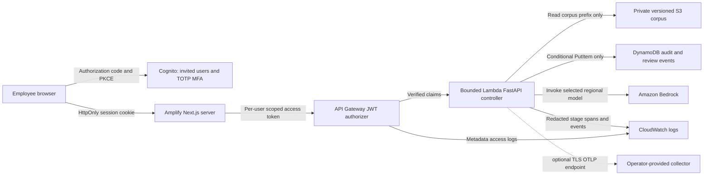

# AWS deployment runbook

**Status: Tokyo deployment and nine-check infrastructure smoke passed on
2026-09-15; project application and bootstrap resources were then removed.**
CloudFormation CREATE_COMPLETE, reservation three, corpus integrity and legitimate
scoped OAuth were verified before cleanup. See [final execution and disposition](final-validation-cleanup.md).
Live Bedrock evaluation and hosted Amplify frontend
build remain separate, unverified milestones. Local/container and credential-free
CDK checks alone establish neither cloud authentication nor model capacity.

The stack is a deployable starting point for a synthetic portfolio demo. An
institution would require separate security, privacy, architecture, resilience,
model-risk, and change-management reviews. This project implies no bank affiliation.

## Resource and trust boundaries



- **S3:** all public access blocked; bucket-owner enforced; TLS enforced; SSE-S3;
  versioning; noncurrent versions expire after 90 days. Current documents are
  retained. The agent can read only objects in `corpus/*`, using the integrity
  manifest; it cannot list the bucket or write objects. A separate ingestion operator must
  approve document schema, licensing, classification, text, and provenance.
- **DynamoDB:** on-demand, AWS-managed KMS encryption, point-in-time recovery,
  deletion protection, and a TTL field. The application inserts distinct
  `pk`/`sk` events conditionally; its IAM role permits only `PutItem`. This is
  application-level append semantics: IAM `PutItem` alone cannot prevent an
  attacker holding runtime credentials from overwriting a known key. TTL is
  asynchronous and this is not a WORM/compliance archive. Review events do not
  approve or execute a business action.
- **API:** every one of the four application routes requires a Cognito JWT with
  `banking-ai/query`. Requiring a scope avoids treating an ID token as an API
  access token. There is no default proxy route, function URL, customer mutation
  route, or public signup. The handler separately requires gateway JWT claims;
  it does not trust an arbitrary header that claims authentication happened.
- **Runtime:** one 1-GB Lambda container, a 28-second timeout, and a reserved
  concurrency of three. The HTTP API is throttled to two requests/second with
  a burst of five. The only Bedrock permissions are invocation and streaming
  invocation on one exact regional foundation-model ARN. Cross-region inference
  profiles are intentionally rejected until their regional data boundaries and
  explicit IAM destinations are reviewed.
- **Telemetry:** API access logs contain request ID, route, status, and timing;
  they exclude bodies, credentials, and identity. Application logs receive
  sanitized audit events and OpenTelemetry stage spans. Application, API access,
  and Amplify SSR CloudWatch log groups retain 30 days. Amplify's separate hosting
  access logs remain until the app is deleted. Three CloudWatch alarms and a dashboard expose latency, errors,
  and throttles. Alarm actions are not wired to an on-call service by default.

The runtime is outside a VPC to avoid NAT fixed costs. It uses TLS AWS APIs but
has general network egress. The application exposes no arbitrary HTTP, shell, or
code tool. Network-level egress restriction, private endpoints, WAF/rate limits
per identity, CloudTrail data events, customer-managed keys, and immutable archival
are deployment gaps for a real institution. The wildcard resource on X-Ray trace
submission and Amplify's `logs:DescribeLogGroups` is required by those operations;
it is not a wildcard banking-data permission.

## Local verification

Use Python 3.11+ and a supported Node.js 22 or 24 runtime. CDK's Python bindings
launch Node via jsii. From the repository root, with the project environment active:

```sh
python -m pip install -r requirements.lock
cd infra/cdk
npm ci
cd ../..
python -m pytest infra/cdk/tests -q
python -m infra.cdk.app
node infra/cdk/node_modules/aws-cdk/bin/cdk --app "python -m infra.cdk.app" synth
```

`python -m infra.cdk.app` writes `infra/cdk/cdk.out` and uses the synthetic account
`111111111111` and `us-east-1` when environment configuration is absent. This
fallback exists for offline assertions only. Never deploy this fallback target.
Synthesis hashes a Docker asset; it does not build the image or call AWS. The
Docker context excludes Git history, local environments, runtime audits, generated
artifacts, docs, frontend, tests, evaluations, node_modules, builds, caches, and
secret-file patterns. Explicit COPY statements further narrow
the image contents. The runtime dependencies come from `requirements-runtime.lock`.
The Lambda base image is a moving AWS Python tag; a production release should
resolve it to a reviewed digest, scan it, and sign the resulting image.

## Reviewable deployment

1. Select an AWS sandbox account and region. Verify the selected model supports
   regional on-demand invocation and the account has access; the default is
   `amazon.nova-lite-v1:0`. Changing a model also requires revisiting token-rate
   configuration and running live evaluation. AWS model availability can differ
   by region and account.
2. Configure `CDK_DEFAULT_ACCOUNT` and `CDK_DEFAULT_REGION` with the actual target,
   authenticate with a short-lived AWS profile, and verify `aws sts get-caller-identity`.
   Do not put access keys in the repository. Docker must be running.
3. Run `node infra/cdk/node_modules/aws-cdk/bin/cdk --app "python -m infra.cdk.app" bootstrap` once for the target;
   this creates billable/bootstrap resources. Then synthesize and inspect
   `node infra/cdk/node_modules/aws-cdk/bin/cdk --app "python -m infra.cdk.app" diff` before running `make deploy`.
   The direct deployment command is
   `node infra/cdk/node_modules/aws-cdk/bin/cdk --app "python -m infra.cdk.app" deploy --require-approval broadening --outputs-file .runtime/cloud-outputs.json`.
   Actual deployment and subsequent cleanup are recorded in
   [final verification](final-validation-cleanup.md); this section is the reusable procedure.
4. For a Git-connected Amplify build, create a Secrets Manager secret containing
   the GitHub access token in its entire plaintext SecretString; grant the
   CloudFormation deployment role permission to read this secret. Supply
   `-c web_repository=https://github.com/YOUR-OWNER/banking-ai-prototype-lab`
   and `-c github_token_secret_name=portfolio/amplify-github` to CDK. Never supply
   the token itself in command arguments, context, `.env`, or source control.
   Alternatively, deploy the unconnected hosting shell, then connect the
   repository through the Amplify console and enable builds on the branch.
   That shell does not yet serve a functioning site. The default branch is `main`;
   use `-c web_branch=your-dns-safe-branch` if needed.
5. Amplify runs the monorepo build spec in `infra/cdk/amplify-build.yml`, selecting
   Node.js 22 for both the build and the matching SSR runtime. Only five
   non-secret configuration variables are written to `apps/web/.env.production`
   for Next.js SSR. The app uses code+PKCE with an HttpOnly session cookie and
   sends the user's access token from the server proxy to the API. The Cognito
   callback is `https://BRANCH.APP-ID.amplifyapp.com/api/auth/callback`; the stack
   computes it without a dependency cycle. For a custom domain, configure DNS and
   Amplify domain association, then supply `-c web_origin=https://your-domain`.
   The frontend pins Next.js 15 because AWS currently documents native Amplify
   SSR support through version 15; upgrading the framework requires rechecking
   that hosting compatibility, then verifying a real build. See the
   [AWS compatibility matrix](https://docs.aws.amazon.com/amplify/latest/userguide/ssr-amplify-support.html).
6. Build the reviewed corpus using
   `python scripts/build_corpus.py --output .runtime/corpus --prefix corpus/`.
   This exports one JSON-encoded `Document` per object, preserving provenance,
   and creates an integrity manifest containing each object key and SHA-256 hash.
   Upload using a deployment operator, not the agent role. Use the `CorpusBucket`
   stack output in these commands, first the documents and **then** the manifest:

   ```sh
   aws s3 sync .runtime/corpus s3://CORPUS-BUCKET/corpus/ --exclude manifest.json
   aws s3 cp .runtime/corpus/manifest.json s3://CORPUS-BUCKET/corpus/manifest.json
   ```

   Publishing the manifest last prevents reads from discovering objects before
   upload. Changing existing object keys is not a transactional corpus rollout:
   readers can briefly reject mismatched hashes; versioned release prefixes would
   be needed for uninterrupted production updates. Retrieval caches for 60 seconds.
   Do not upload adversarial evaluation overrides to the standard corpus. No
   `--delete` operation is needed. The deployment wrapper performs this upload
   after stack deployment; if it fails, the cloud application is not ready.
7. Invite a synthetic/demo employee in the Cognito console. Self signup is
   disabled. Complete the password change and TOTP enrollment at first login.
   Verify successful login and query, then verify missing/expired tokens and
   tokens without the custom scope return 401/403. Check the Lambda audit item,
   model token counts, logs, citations, and review status for the same request.
8. Set an optional account-wide budget notification with
   `-c alert_email=YOUR-OPERATIONS-ADDRESS -c monthly_budget_usd=25`. It alerts at
   80% of actual account monthly spend; it is delayed and is **not** an automatic
   spending cap. Configure CloudWatch alarm actions and validate notification
   delivery before relying on monitoring.

The stack retains S3, DynamoDB, Cognito, and explicit logs on removal. DynamoDB
deletion protection is enabled. Clean up deliberately through a separate approved
retention process; `cdk destroy` alone does not remove retained data or stop every
associated storage charge. Account-wide budget removal does not remove resources.

## OpenTelemetry and cost limitations

Application spans exist even without a remote collector; the Lambda console
exporter makes them visible in CloudWatch. Lambda active X-Ray tracing captures
infrastructure segments. It does **not** automatically turn application OTel spans
into complete X-Ray step traces. To export application traces, supply an approved
TLS endpoint using `-c otlp_endpoint=https://collector.example` and configure that
collector's authentication, permissions, network access, retention, and sampling.
This repository does not provision or verify a production OTLP collector in AWS.
Do not enable raw Strands prompt/completion capture; the stack explicitly disables it.

The default input/output rates (`0.06`/`0.24` USD per million tokens for the default
Nova Lite scenario) are configurable **illustrative estimates**, not a pricing
quote or a billed result. Use `-c input_usd_per_million=...` and
`-c output_usd_per_million=...` after checking current regional prices. Cost estimates
exclude Lambda, API Gateway, storage, requests, Amplify SSR/build/bandwidth, Cognito,
telemetry, egress, Secrets Manager, and taxes. At 2,000 input plus 500 output tokens,
these assumptions yield $0.00024 model cost per call, before those services.
See [COST.md](../COST.md) for the complete estimate and [PRODUCTION_READINESS.md](../PRODUCTION_READINESS.md)
for the promotion gates. Live latency and model quality remain unmeasured.

## Verified official references

- [API Gateway JWT validation and access-token scopes](https://docs.aws.amazon.com/apigateway/latest/developerguide/http-api-jwt-authorizer.html)
- [CDK HttpJwtAuthorizer API](https://docs.aws.amazon.com/cdk/api/v2/python/aws_cdk.aws_apigatewayv2_authorizers/HttpJwtAuthorizer.html)
- [Amplify Next.js hosting support](https://docs.aws.amazon.com/amplify/latest/userguide/ssr-amplify-support.html)
- [Amplify SSR environment variables and monorepo handling](https://docs.aws.amazon.com/amplify/latest/userguide/ssr-environment-variables.html)
- [Amplify CloudWatch service-role permissions](https://docs.aws.amazon.com/amplify/latest/userguide/cloudwatch-logs-role.html)
- [CDK Amplify CfnApp API](https://docs.aws.amazon.com/cdk/api/v2/python/aws_cdk.aws_amplify/CfnApp.html)
- [Amazon Nova Lite model card](https://docs.aws.amazon.com/us_en/bedrock/latest/userguide/model-card-amazon-nova-lite.html)

## Infrastructure-only verification while model capacity is unavailable

After obtaining a legitimate Cognito access token with `banking-ai/query`, keep it
in the private operator environment as `AWS_SMOKE_ACCESS_TOKEN`; never put it in
arguments, source files or public evidence. With verified Tokyo outputs and SSO
credentials, run:

```sh
AWS_REGION=ap-northeast-1 .venv/bin/python -m scripts.aws_smoke --infrastructure-only
```

This mode sends only the fixed prohibited-credit request. It verifies the existing
refusal before model planning, zero model tokens/latency/cost, citations, required
human review, and the same nine resource/auth/audit/log checks. A PASS applies
only to that infrastructure/refusal scope. The default `make aws-smoke` includes
a normal model-backed request and must wait for separately verified usable
Tokyo capacity. Neither mode substitutes for the independent live evaluation.
