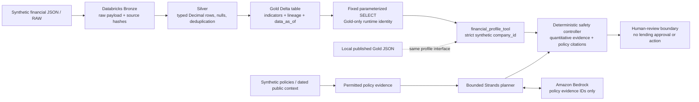

# Governed synthetic SME financial analytics

Databricks has one responsibility: publish validated, deterministic financial
indicators. The application reads a governed Gold profile through a strict tool;
it does not give the LLM SQL, raw financial rows, credentials, or lending authority.
Every company and financial record is fictional. No real bank is represented.

The local pipeline and adapter contracts are verified. Real authentication and
bundle deployment passed in Free Edition; native execution is **FAIL / BLOCKED**
by workspace-file reads. Gold integration remains **NOT TESTED**; see
[validation evidence](databricks-validation.md).



The workflow plans policy evidence before loading the profile. Therefore Gold
metrics and underlying financial rows do not enter the Bedrock prompt. A question
can still contain figures the caller explicitly types; it receives the existing
PII redaction and untrusted-input treatment. Model output can select evidence IDs
and request an already typed calculation. It cannot construct SQL, company IDs,
metric values, tool arguments, or a financial approval.

## Reproducible layers

`data/synthetic/financial_raw.json` contains 20 monthly source records for three
SMEs: a complete example, an incomplete example, and an old example. The fixture
contains one exact duplicate and one invalid monetary value. The developer-only
generator is `databricks/generate_fixture.py`; runtime code never invokes it.

| Layer | Contract |
| --- | --- |
| RAW | Versioned synthetic JSON with monthly revenue, inflow/outflow, scheduled debt service, closing balance, industry, transaction count, company ID, record ID, and observation time. |
| Bronze | Every row is retained as canonical JSON with ordinal and row SHA-256; SHA-256 of the exact raw file links the complete dataset. |
| Silver | First-day month keys, completed monthly observations, UTC timestamps, exact Decimal values, JPY, synthetic IDs, controlled industry values and bounded counts. Invalid rows are quarantined with error codes. |
| Gold | One profile per company with four indicators, missing/data-quality flags, covered period count, month-end freshness date, formula version and source record/hash lineage. |

The shared implementation in `packages/financial/pipeline.py` validates and
computes these logical layers. `databricks/run_pipeline.py` runs it on the job
driver and publishes typed Delta tables: `financial_bronze`, `financial_silver`,
`financial_rejected`, and `financial_gold`. This is deliberately a bounded Python
batch (2 MB, 5,000 source rows, at most 120 months per company), not a distributed
Spark feature engineering engine. Both modes use the same Decimal formulas.

Normalized identical duplicate rows collapse. Different records for the same
company/month are excluded and produce `conflicting_duplicate`; the pipeline
does not guess a winning record. Invalid rows associated with a valid synthetic
company produce `rejected_records`. A company with no valid remaining months
has no profile. Industry and transaction count are retained in Silver and checked
for missing values; they are not used as risk scores.

## Formula contract `sme-gold-v1`

The calculation window is the valid observed months present in the fixture, up
to 120 months. Revenue and volatility need at least two observations. Values are
rounded with Decimal `ROUND_HALF_UP`, at two decimal places for trend/volatility
and four for debt/liquidity ratios. Ratios have no embedded credit threshold.

| Gold field | Formula and unit | Missing/invalid input behavior |
| --- | --- | --- |
| `revenue_trend` | `(last monthly revenue / first monthly revenue - 1) * 100`, percent | Null if any monthly revenue is absent, fewer than two months, or the first revenue is zero. |
| `cashflow_volatility` | Population standard deviation of monthly `(cash_inflow - cash_outflow)`, JPY | Null if any required flow is absent or fewer than two months. |
| `debt_service_ratio` | Sum of scheduled debt service / sum of operating cash inflow, dimensionless share | Null if required inputs are absent or total inflow is zero. This is not a debt-service coverage ratio. |
| `liquidity_indicator` | Latest closing balance / mean monthly operating cash outflow, months | Null if any balance or outflow is absent or mean outflow is zero. A negative closing balance can produce a negative indicator. |

No missing value is imputed to zero. Gaps and rejected/conflicting records are
explicit flags; unaffected indicators can still be reported over the remaining
valid observations. That partial window must be reviewed, and it is not comparable
to an uninterrupted period without further analysis. `data_as_of` is the latest
covered calendar month-end at UTC midnight, rather than ingestion time. Re-ingesting
old statements cannot make their business data fresh. The original `observed_at`
remains in Silver. Request-time freshness defaults to 45 days and is configurable
from 1 to 365; future-dated profiles fail closed.

## Tool and trust boundaries

`AgentRequest.company_id` is optional. Its complete allowed format is
`SYN-SME-` plus three digits (exactly 11 characters). When present, the controller
requires credit-policy coverage and enables a sixth tool with exactly this schema:

```json
{"company_id": "SYN-SME-001"}
```

`financial_profile_tool` returns the typed `FinancialProfile` or no record. Both
adapters and the tool verify company identity and canonical Gold hash. The response
has an optional `financial_profile` alongside its ordinary policy `evidence` and
`citations`. Quantitative evidence includes dataset hash, Gold record hash, exact
formula definitions, source record IDs, source table, adapter, currency, period
count, and data date. The answer renders metrics deterministically and includes
the Gold hash. Hashes establish integrity against the supplied snapshot; they are
not signatures or proof that a malicious authorized publisher used correct data.

All company requests require human review regardless of model output. Missing or
stale data adds explicit risk flags and required follow-up. An unavailable, invalid,
ambiguous or future profile causes abstention, no numerical output and human review.
Prohibited approval/bypass requests never call the financial provider. The endpoint
cannot accept supplied profile objects, SQL, unrecognized schema fields or a
model-generated company selector. It has no credit approval or transaction endpoint.

The local adapter reads only `financial_gold.json`. The Databricks adapter uses
the shipped, pinned SDK and one Statement Execution request with the fixed SQL:

```sql
SELECT profile_json, profile_sha256
FROM financial_gold WHERE company_id = :company_id LIMIT 2
```

Catalog, schema and warehouse are validated deployment configuration. The company
ID is a named STRING parameter. Inline JSON results are capped at 64 KiB and two
rows so duplicates can be rejected; only one matching profile is accepted. The
adapter refuses pagination, external result URLs, truncation, unexpected columns
or types, and unrecognized profile metadata. It waits ten seconds with cancellation
requested at timeout, and never follows a result link. Databricks timeout cancellation
is best effort, not a warehouse billing guarantee. The SDK HTTP timeout is 12 seconds
with a one-second retry budget. These settings follow the official
[Statement Execution contract](https://databricks-sdk-py.readthedocs.io/en/stable/workspace/sql/statement_execution.html)
and [parameterized query guidance](https://docs.databricks.com/aws/en/dev-tools/sql-execution-tutorial).

The runtime identity should have warehouse CAN USE and Unity Catalog USE CATALOG,
USE SCHEMA and SELECT on Gold only. The publisher identity needs separate schema
and Delta write permissions. These grants require actual workspace setup and are
not created by the AWS CDK stack. Synthetic-only caller access is demonstrated;
per-company entitlements are not implemented. Do not attach real customer data.

SDK credentials use the environment or a supported unified-auth provider. Only an
AWS Databricks HTTPS workspace hostname is accepted. SDK payload logging is
suppressed; runtime audit and tool spans record tool name, status and duration,
without company ID, profile values, raw rows, SQL results or credentials. The JSON
verification artifact intentionally contains public synthetic metrics and lineage.

## Deployment and operational limits

The development bundle defines one unscheduled serverless Python job with a
15-minute job timeout and one concurrent run. Its sync paths preserve the repository
package/data hierarchy as specified in the official
[bundle configuration reference](https://docs.databricks.com/aws/en/dev-tools/bundles/reference).
Spark publishes Gold last. Individual table overwrites are atomic Delta operations;
the four-table batch is not one transaction. A failed run can leave old Gold beside
new Bronze/Silver, which source hashes expose. Historical retention, atomic promotion,
incremental ingestion, external data quality governance, signatures and entitlements
need production design.

The existing Lambda timeout is 28 seconds. A combined slow S3 retrieval, Bedrock
planning and SQL request can exceed it even though individual model/SQL calls are
bounded. End-to-end deadline propagation, timeout/audit recovery and cold-warehouse
latency are unverified production gaps. A process hard timeout cannot guarantee a
final audit record. Databricks compute and warehouse charges are additional to
Bedrock/AWS costs in paid deployments. Two failed Free Edition job wall times are
recorded in [validation evidence](databricks-validation.md); successful pipeline/
query latency and an actual metered cost remain unmeasured.
